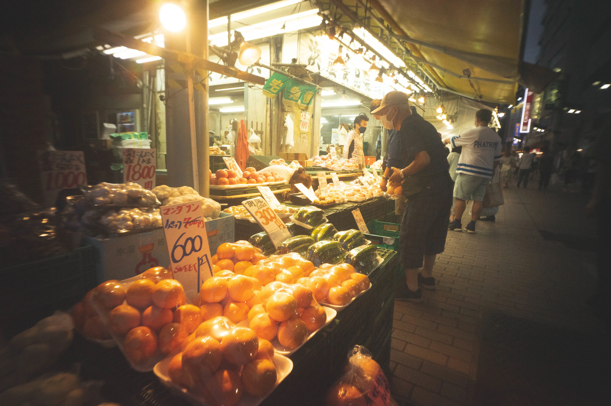

I bought a Wtulens I've been interested in for several years, and took these photos at Ueno, Tokyo. This lo-fi atmosphere is so cool.

<!--   -->
<!---->
<!-- 数年前から気になっていた Wtulens を思い出したように購入し，東京・上野で撮影。この lo-fi 感が好き。 -->

## Equipments

- Sony α7Ⅱ
- GIZMON Wtulens L

## Video

  <iframe
    src="https://www.youtube.com/embed/2XzdaL--W2k?si=guuBjHot2b80h_SO"
    title="in the lights"
    class="w-full"
    style="border-radius: 30px; aspect-ratio: 4 / 3;"
  ></iframe>

