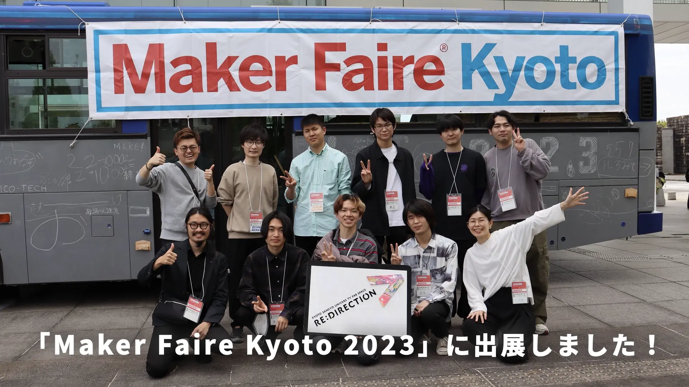

I produced an archive video of the university's fab space exhibit at Maker Faire Kyoto 2023, a manufacturing exhibition event held on April 29 and 30, 2023, at the Keihanna Open Innovation Center (KICK).
In addition to the gymnastics exhibit for preschool children, in which they learned about the features of digital machine tools by moving their bodies, we set up the exhibit, filmed the exhibit, and edited the archival video.

<!--   -->
<!---->
<!-- 2023 年 4 月 29 日・30 日に，けいはんなオープンイノベーションセンター（KICK）で開催されたものづくり展示イベント「Maker Faire Kyoto 2023」に大学のファブスペースとして出展したときのアーカイブ動画を制作した。 -->
<!-- 未就学児を対象にした，体を動かしてデジタル工作機械の特徴を学ぶ体操の展示に加え，設営・展示風景の撮影・アーカイブ動画の編集を行った。 -->

## Archive Video

  <iframe
    src="https://www.youtube.com/embed/154Jtlnmq2U?si=EnhFL7L-3sGmBcvA"
    title="MFKyoto 2023 Archive Video"
    class="w-full"
    style="border-radius: 30px; aspect-ratio: 16 / 9;"
  ></iframe>

## Press Release

[【情報理工学部】ファブスペースと平井研＆蚊野研が「Maker Faire Kyoto 2023」に出展しました！](https://www.kyoto-su.ac.jp/news/2023_ise/20230523_196_makerfairekyoto2023.html)
