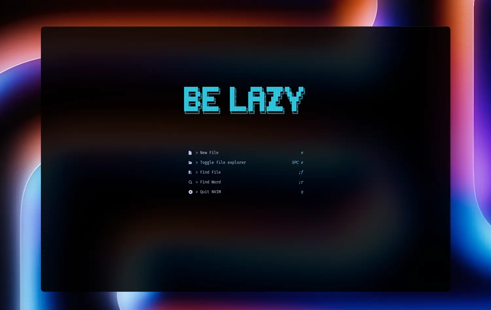
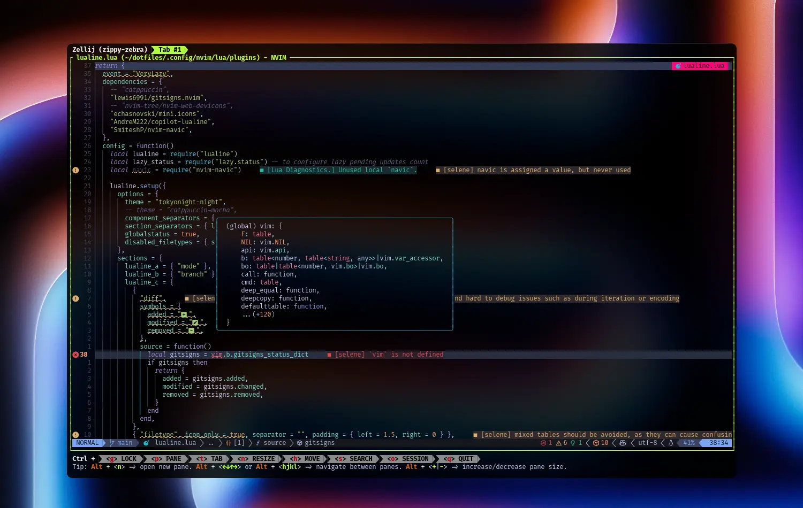
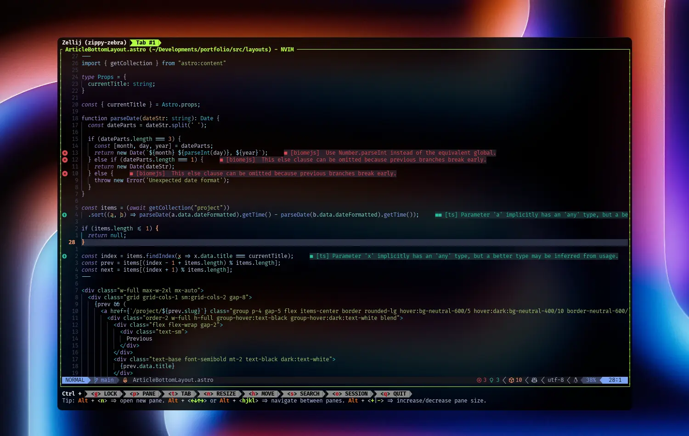

## I love Neovim

- This dotfiles repository is to make my development environment supremely cool and to keep me happy.
- If you have a better tool or advice on how to do it better, I would be happy to hear it.
- These configs (especially Neovim config) are based on [craftzdog/dotfiles-public](https://github.com/craftzdog/dotfiles-public) and [josean-dev/dev-environment-files](https://github.com/josean-dev/dev-environment-files). Thank you very much.
- I also referred to many other documents for these configs. Thanks to all open source projects.
- In addition, some of these configs are written with the reliable copilot, ChatGPT and Claude.

## Screenshots

## Source Code

- [shuheykoyama/dotfiles](https://github.com/shuheykoyama/dotfiles)
