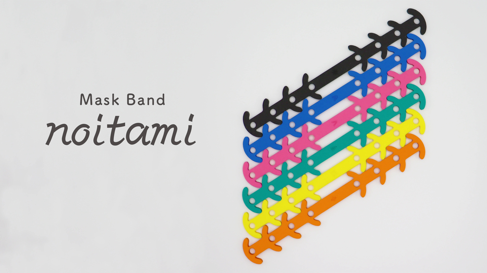

Focusing on the problem of ear pain caused by wearing masks for long hours every day to prevent infections, we designed and developed an original mask band that is discreet and does not cause ear pain, utilizing the digital fabrication equipment at the university's digital fabrication facility.
The mask band has the following features

- Easy to wear with the mask
- Less wearing sensation and no tightness
- Can be customized by adjusting to the size that best suits you.

This mask band is produced by cutting the external shape using a laser cutting machine and laser engraving it. The material used is EVA, which has excellent flexibility and elasticity and can be disinfected and washed with water. In the development process, the software design was materialized using digital machine tools, and the prototyping process was repeated many times to verify the actual product by touching it, resulting in a quick trial-and-error process unique to digital fabrication.
The mask bands were distributed to participants at a workshop held at the open campus on August 7-8, 2021.

<!--   -->
<!---->
<!-- 感染症防止のためにマスクを毎日長時間装着することで耳が痛くなる問題に着目し，大学のデジタルファブリケーション施設のデジタル工作機器を活用して，耳が痛くならず目立たないオリジナルのマスクバンドをデザイン・開発した。 -->
<!-- 本マスクバンドには次のような特徴がある： -->
<!---->
<!-- - マスクと一緒につけやすい -->
<!-- - 装着感が少なく、締め付けられている感覚がない -->
<!-- - 自分に合ったサイズに調整して、カスタマイズすることができる -->
<!---->
<!-- 本マスクバンドは，レーザー加工機で外形形状を切断加工し，レーザー彫刻を施して制作している。素材には，柔軟性や弾力性に優れ，消毒・水洗い可能な EVA を使用している。開発過程では，ソフトウェア上で設計したものをデジタル工作機器で実体化し，実物を触って確かめるプロトタイピングを何度も繰り返し，デジタルファブリケーションならではの素早い試行錯誤を行った。 -->
<!-- 本マスクバンドは，2021 年 8 月 7 日〜8 日に開催されたオープンキャンパスでのワークショップにて参加者へ配付された。 -->

## Presentation at the Workshop

  <iframe
    src="https://www.youtube.com/embed/j-7uK22wKHo?si=nZCHYYFBceDr5GZJ"
    title="noitami Presentation Video"
    class="w-full"
    style="border-radius: 30px; aspect-ratio: 16 / 9;"
  ></iframe>

## Press Release

[情報理工学部生が耳が痛くならず目立たないオリジナルのマスクバンドを開発！](https://www.kyoto-su.ac.jp/news/2021_ise/20210826_196_mask.html)
