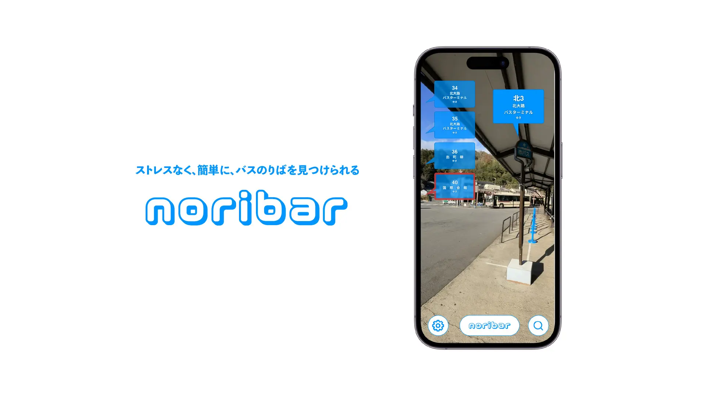

In an environment where there are multiple bus stops with the same name, how can we make it easier to find the desired bus stop at a glance?
The design concept of this service is to make it easy and stress-free to find the bus stop by using AR technology.
This is the final prototype for the "Interaction Design" course offered in the fall semester at Kyoto Sangyo University.

<!--   -->
<!---->
<!-- 同じ名前のバス停でものりばが複数ある環境において，目的のバスのりばの場所が分かりにくいという状況を，どうすれば一目で簡単に分かるようにできるだろうか，という課題を解決するために提案するサービスである。 -->
<!-- 本サービスでは，AR 技術を活用することで，ストレスなく，簡単に，バスのりばを見つけられることをデザインコンセプトとしている。 -->
<!-- 京都産業大学情報理工学部「インタラクションデザイン論」での最終プロトタイプ。 -->

## Video

  <iframe
    src="https://www.youtube.com/embed/VB04rDQFqDM?si=SsGDSEuV9rP9vSWc"
    title="noribar PV"
    class="w-full"
    style="border-radius: 30px; aspect-ratio: 16 / 9;"
  ></iframe>

