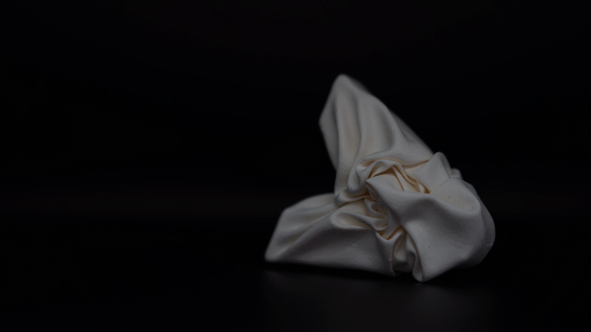

This sample was created by transforming the symbol mark of Kyoto Sangyo University FabSpace.
Using the Vellum function of Houdini, a 3DCG software that specializes in fluid expression, a 3D model of the symbol covered with a cloth was created and fabricated on a dual-head 3D printer (Ultimaker 3 Extended).
Since the data exported from Houdini had too many meshes to be printed in 3D, the number of meshes was reduced using Meshmixer, another 3D modeling software, to create the final 3D model.
The modeling object is hard because of the use of PLA filament, but the soft texture like a fabric is the most attractive and distinctive feature.

<!--   -->
<!---->
<!-- 京都産業大学ファブスペースのシンボルマークを変形して制作したサンプルである。 -->
<!-- 流体表現が得意な 3DCG ソフトウェア Houdini の Vellum という機能を用いて，シンボルマークに布を被せたような 3D モデルを制作し，デュアルヘッドの 3D プリンタ（ Ultimaker 3 Extended ）で造形した。 -->
<!-- Houdini から書き出したデータのままではメッシュ数が多く 3D プリントできなかったため，Meshmixer という別の 3D モデリングソフトウェアでメッシュ数を減らして最終的な 3D モデルに仕上げている。 -->
<!-- PLA フィラメントを使用しているため造形物は硬いが，まるで布地のような柔らかみを感じるテクスチャが最大の特徴かつ魅力である。 -->
