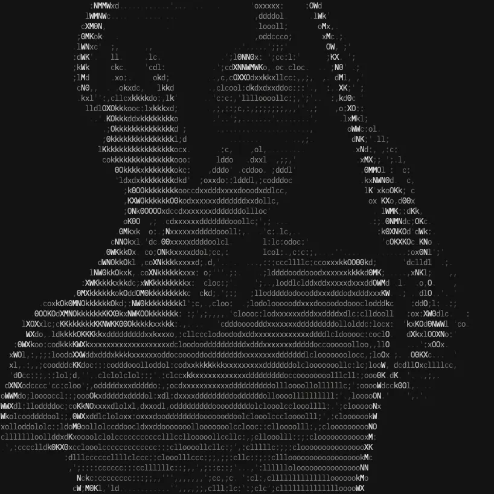

tnap is a screen saver for the terminal. You can rest the terminal in a secure.

## Features

- Display images in the terminal and use it as a screen saver
- Convert images to ASCII art
- Use images generated using DALL-E 3
- Generate by simply specifying a key in config.toml without thinking a prompt
- Of course, you can also generate images by specifying a prompt

## Screenshots

:::grid

:::

## Demo Video

  <video
    controls
    class="w-full"
    style="border-radius: 30px; aspect-ratio: 16 / 9;"
    autoplay="autoplay"
    muted="muted"
    loop="loop"
    ><source src="/assets/images/projects/tnap-demo.webm" type="video/mp4" />
  </video>

## Source Code

- [pigeon-sable/tnap](https://github.com/pigeon-sable/tnap)
