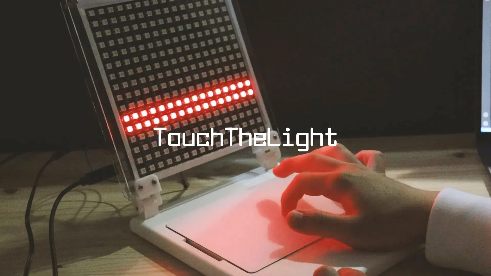

Focusing on the experience of naturally getting into the rhythm of the body, such as tapping the rhythm with one's fingers while listening to music, this work adds an interactive visual experience to the conventional music experience by making LEDs blink in response to the movement of one's own fingers.
This is the final product of the "Digital Fabrication" course offered in the fall semester of the Faculty of Information Science and Technology, Kyoto Sangyo University. [Won the Grand Prize in the 29th Kyoto Sangyo University Digital Contents Contest.](http://info.cse.kyoto-su.ac.jp/?page_id=9957)

<!--   -->
<!---->
<!-- この作品では，音楽を聴いているときに指でリズムを刻むといった，身体が自然とリズムに乗ってしまう経験に着目し，従来の音楽体験に，体験者自身の指の動きに合わせて LED を点滅させるインタラクティブな視覚的体験を付加することで，音楽を視覚的に楽しむことを目指した。 -->
<!-- 京都産業大学情報理工学部「デジタルファブリケーション」での最終制作物。[第 29 回京都産業大学デジタルコンテンツコンテスト最優秀賞受賞。](http://info.cse.kyoto-su.ac.jp/?page_id=9957) -->

## Video

  <iframe
    src="https://www.youtube.com/embed/oq2FVPgH58k?si=4tYJiGMHWlaNS5Vo"
    title="TouchTheLight PV"
    class="w-full"
    style="border-radius: 30px; aspect-ratio: 16 / 9;"
  ></iframe>

